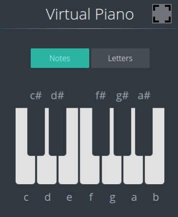

# Portfolio of Golubeva Marina
 - Self introduction: https://www.youtube.com/watch?v=7r7Fa5v1ow8&t=179s
 - Linkedlin: www.linkedin.com/in/golubeva-webmaster
 - CV: https://golubeva-webmaster.github.io/rsschool-cv/
 - Portfolio: https://github.com/golubeva-webmaster/Portfolio/blob/main/README.md
 
## Photo-filter
<table border="0">
<tr>
    <td>
        <ul>
            <li>Task: https://rolling-scopes-school.github.io/stage0/#/stage1/tasks/js-projects/photo-filter</li>
            <li>Work: https://rolling-scopes-school.github.io/golubeva-webmaster-JSFE2021Q1/photo-filter/</li>
            <li>Key skills: work with files, upload local files, save files to computer, work with Date, Canvas API</li>
            <li>24.04.2021</li>
    </td>
    <td width="40%">
        
    </td>
</tr>
</table>

## Online-zoo - animal observation site
<table border="0">
<tr>
    <td>
        <ul>
            <li>Task: https://rolling-scopes-school.github.io/stage0/#/stage1/tasks/online-zoo/variant-2</li>
            <li>Work: https://rolling-scopes-school.github.io/golubeva-webmaster-JSFE2021Q1/online-zoo/</li>
            <li>Key skills: layout for desktop skrins, adaptive for 1920px, 1200px. JS: multi-popups whith form, automatic carousel, sliders: horizontal and vertical</li>
            <li>April 2021</li>
    </td>
    <td width="40%">
        
    </td>
</tr>
</table>

## Credit in basket from Sber
<table border="0">
<tr>
    <td>
        <ul>
            <li>Task: "Sberbank credit"</li>
            <li>Work code: https://github.com/golubeva-webmaster/working_practices_on_bitrix/tree/main/js/sber</li>
            <li>Key skills: work with DOM (JS), ajax requests (JS), curl requests (php), cron</li>
            <li>April 2021</li>
    </td>
    <td width="40%">
        
    </td>
</tr>
</table>

## Google tag manager
<table border="0">
<tr>
    <td>
        <ul>
            <li>Task: "Google tag manager" selections on various pages of the store</li>
            <li>Work code: https://github.com/golubeva-webmaster/working_practices_on_bitrix/tree/main/googleTagManager</li>
            <li>Key skills: work with DOM (JS),work with curl requests (php) </li>
            <li>March 2021</li>
    </td>
</tr>
</table>

## Virtual-piano
<table border="0">
<tr>
    <td>
        <ul>
            <li>Task: https://rolling-scopes-school.github.io/stage0/#/stage1/tasks/js-projects/virtual-piano</li>
            <li>Work: https://rolling-scopes-school.github.io/golubeva-webmaster-JSFE2021Q1/virtual-piano/</li>
            <li>Key skills: work with DOM, work with sound, work with Fullscreen API, mouse events, keyboard events</li>
            <li>17.03.2021</li>
    </td>
    <td width="40%">
        
    </td>
</tr>
</table>

## Puzzle game
<table border="0">
<tr>
    <td>
        <ul>
            <li>Task: https://github.com/rolling-scopes-school/tasks/blob/master/tasks/gem-pazzle/codejam-the-gem-puzzle.md</li>
            <li>Work: https://rolling-scopes-school.github.io/golubeva-webmaster-JS2020Q3/gem-puzzle/</li>
            <li>only for Google Chrome</li>
            <li>Key skills: work with DOM, work with Local Storage, adaptive design</li>
            <li>16.11.2020</li>
    </td>
    <td width="40%">
        
    </td>
</tr>
</table>

## Virtual keyboard
<table>
<tr>
    <td>
        <ul>
            <li>Task: https://github.com/rolling-scopes-school/tasks/blob/master/tasks/ready-projects/virtual-keyboard.md</li>
            <li>Work: https://rolling-scopes-school.github.io/golubeva-webmaster-JS2020Q3/virtual-keyboard/index.html</li>
            <li>Key skills: JS mouse events, JS keyboard events</li>
            <li>1.11.2020</li>
    </td>
    <td width="40%">
        
    </td>
</tr>
</table>

## Shelter
<table>
<tr>
    <td>
        <ul>
            <li>Task: https://github.com/rolling-scopes-school/tasks/blob/master/tasks/markups/level-2/shelter/shelter-adaptive-ru.md</li>
            <li>Work: https://rolling-scopes-school.github.io/golubeva-webmaster-JS2020Q3/shelter/pages/main/index.html</li>
            <li>Key skills:  HTML, CSS, adaptive design</li>
            <li>1.11.2020</li>
    </td>
    <td width="40%">
        
    </td>
</tr>
</table>

## Momentum
<table>
<tr>
    <td>
        <ul>
            <li>Task: https://github.com/rolling-scopes-school/tasks/blob/master/tasks/ready-projects/momentum.md</li>
            <li>Work: https://rolling-scopes-school.github.io/golubeva-webmaster-JS2020Q3/momentum/</li>
            <li>Key skills:  adaptive design, work with quotess API, work with weather forecast API</li>
            <li>25.10.2020</li>
    </td>
    <td width="40%">
        
    </td>
</tr>
</table>

## Calculator
<table>
<tr>
    <td>
        <ul>
            <li>Task: https://github.com/rolling-scopes-school/tasks/blob/master/tasks/ready-projects/calculator.md</li>
            <li>Work: https://rolling-scopes-school.github.io/golubeva-webmaster-JS2020Q3/calculator/</li>
            <li>Key skills: operations with negative numbers, operations with fractions</li>
            <li>18.10.2020</li>
    </td>
    <td width="40%">
        
    </td>
</tr>
</table>

